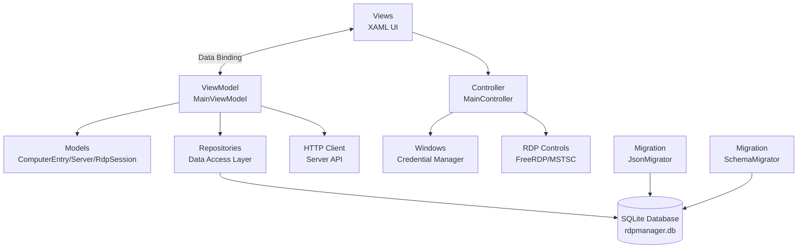
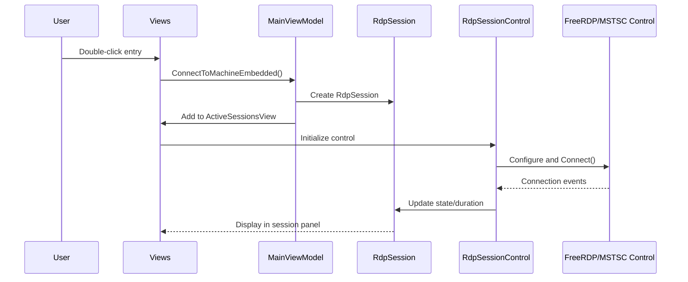
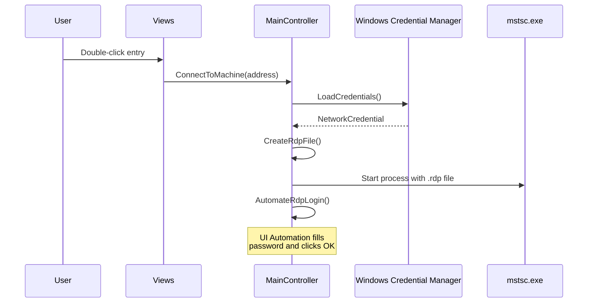

# RDP Manager

A modern Windows desktop application for managing Remote Desktop Protocol (RDP) connections with hierarchical organization, secure credential storage, embedded file explorer, and system tray integration.

## Features

- **Hierarchical Organization** - Organize computers and servers into nested groups with drag-and-drop reordering
- **Secure Credential Management** - Credentials stored securely in Windows Credential Manager with automatic login
- **SQLite Persistence** - Robust database storage with automatic migration from legacy JSON files
- **Embedded RDP Sessions** - RDP connections open in tabs within the application using FreeRDP or MSTSC control
- **File Explorer Integration** - Built-in file explorer for browsing remote machine file systems, with ability to open Windows File Explorer
- **System Tray Integration** - Minimizes to system tray instead of closing; double-click tray icon to restore
- **Connection History & Favorites** - Track recent connections, mark favorites, and view connection duration
- **Server Discovery (optional)** - Fetch and display a server inventory from a configurable HTTP API endpoint
- **Kubernetes Integration (optional)** - Manage GKE clusters, authenticate via `gcloud`, and browse pods/deployments/events with `kubectl`
- **Tags System** - Organize computer entries with custom tags for better categorization
- **Advanced Filtering** - Search and filter server entries across all properties
- **Theme Support** - Light and dark theme support with persistent preferences
- **Material Design UI** - Modern, clean interface using Material Design themes
- **Session Management** - Pop-out sessions to separate windows, track connection state and duration

## Installation

### Prerequisites
- Windows 10 or later
- .NET 10.0 Runtime

### From Release
1. Download the latest release from the Releases page
2. Extract the ZIP file
3. Run `RdpManager.exe`

### From Source
```bash
# Clone the repository
git clone https://github.com/<your-username>/RdpManager.git
cd RdpManager

# Build the project
dotnet build RdpManager/RdpManager.sln --configuration Release

# Run the application
dotnet run --project RdpManager/RdpManager/RdpManager.csproj
```

## Application Startup

### Single Instance Enforcement
The application enforces a single instance using a mutex. If you try to launch a second instance, the existing window will be brought to the foreground automatically.

### First Launch
On first launch, the application will:
1. Create the SQLite database (`rdpmanager.db`) in the application directory
2. Initialize the database schema with all required tables and indices
3. If legacy JSON files exist (`computers.json`, `connectionHistory.json`, `preferences.json`):
   - Automatically migrate data to SQLite
   - Create `.backup` files of the original JSON files
   - Preserve all computer entries, connection history, and preferences
4. Load theme preference (defaults to system theme)
5. Display the main window (ModernMainView)

### Subsequent Launches
On subsequent launches:
1. Open the existing SQLite database
2. Check and apply any pending schema migrations
3. Load theme preference from database
4. Restore group expand/collapse states
5. Load computer entries and preferences

## Quick Start

### First Time Setup

1. **Launch the application** - The app will open with the main window visible and perform automatic setup
2. **Set credentials** - Click the "Update" button or go to Settings to configure credentials
3. **Add computers** - Click the "New Entry" button in the toolbar (or press Ctrl+N) to create computer entries

### Connecting to a Machine

**From Main Window:**
- Double-click any computer or server entry
- Or select an entry and click the "Connect" button

**From System Tray:**
- Double-click the system tray icon to restore the main window
- Note: Closing the window minimizes it to the tray instead of exiting the application

### Managing Computer Entries

Computer entries are stored in the SQLite database and support:
- **Friendly Name** - Display name for the connection
- **Machine Name** - Hostname or IP address
- **Domain** - Optional domain name
- **Group** - Hierarchical path (e.g., "Production/Web Servers/IIS")
- **Tags** - Multiple custom tags for categorization
- **Favorites** - Mark frequently used connections as favorites
- **Sort Order** - Custom ordering within groups (drag-and-drop)
- **RDP Settings** - Per-computer settings (screen mode, color depth, audio redirection, etc.)

**Adding Entries:**
1. Click "New Entry" in the toolbar or press Ctrl+N
2. Fill in the required fields (Friendly Name, Machine Name)
3. Optionally specify Domain, Group, and Tags
4. Configure custom RDP settings if needed
5. Click Save

**Organizing with Groups:**
- Use forward slashes to create hierarchical groups (e.g., "Production/Web/IIS")
- Groups are created automatically when saving entries
- Drag and drop entries to reorder them within groups
- Group expand/collapse state is persisted across sessions

## Configuration

### Server Discovery Endpoint (optional)

The **Servers** tab can populate itself from an HTTP API that returns a server inventory.
This is entirely optional — leave it unset and the Servers tab simply stays empty.

Set the endpoint URL in **Settings** (it is persisted to the `Preferences` table in the
database). When no endpoint is configured, the application makes no network call.

The endpoint must return JSON matching the following shape (see `Models/Server.cs` and
`Models/ServerResponse.cs`):

```json
{
  "servers": [
    {
      "server_id": 1,
      "serverName": "web01",
      "domain": "example.local",
      "site": "Primary DC",
      "abbr": "WEB",
      "ipAddress": "10.0.0.10",
      "application": "Web",
      "ram": "16 GB",
      "cpus": "4",
      "os": "Windows Server",
      "osversion": "2022",
      "notes": ""
    }
  ]
}
```

Servers are organized in the tree by Domain / Application / Site.

> An empty `appSettings.json` ships with the app as a placeholder for future configuration;
> it is not currently read at runtime.

### Data Storage

The application uses SQLite for all persistent data:
- `rdpmanager.db` - SQLite database containing all application data

**Automatic Migration:**
On first launch, if legacy JSON files are detected, they will be automatically migrated:
- `computers.json` → Imported to database, backed up as `computers.json.backup`
- `connectionHistory.json` → Imported to database, backed up as `connectionHistory.json.backup`
- `preferences.json` → Imported to database, backed up as `preferences.json.backup`

**Database Schema:**
- **Computers** - Computer entries with groups, favorites, and sort order
- **ComputerRdpSettings** - Per-computer RDP settings (screen mode, color depth, audio, etc.)
- **Tags** - Tag definitions for organizing computers
- **ComputerTags** - Many-to-many relationships between computers and tags
- **Groups** - Group metadata (expanded state, sort order)
- **ConnectionLogs** - Connection history with timestamps, duration, and error codes
- **Preferences** - Key-value preference storage (theme, RDP mode, server endpoint, etc.)
- **FileExplorerSessions** - Saved file explorer session states
- **KubernetesClusters** - Registered GKE cluster definitions

## User Guide

### Tabs Overview

The main window contains the following navigation sections:

1. **Computers** - Manually added computer entries organized by hierarchical groups with drag-and-drop support
2. **Servers** - Servers fetched from the optional API endpoint (organized by Domain/Application/Site hierarchy)
3. **Kubernetes** - GKE clusters you've configured, with authentication and resource browsing (optional)
4. **Recent** - Recently connected machines with connection timestamps
5. **Favorites** - Starred favorite connections for quick access
6. **Active Sessions** - Currently active RDP sessions with connection state, duration, and management controls (appears when sessions are open)
7. **File Explorer** - Browse remote machine file systems with saved session support (appears once you open a session)

> 🎮 There is also a hidden Games tab (Snake) — a small easter egg you can unlock from the Computers view.

### Favorites

Mark any connection as a favorite by clicking the star icon next to an entry. The star will turn gold when favorited.

### Filtering Servers

Use the search box in the left sidebar to filter server entries by any property (server name, domain, application, site, etc.). The tree will automatically expand to show matching results when you navigate to the Servers tab.

### File Explorer

The built-in file explorer allows you to browse remote machine file systems:

**Features:**
- Browse remote directories and files
- Save session states for quick access to frequently used locations
- Open Windows File Explorer at the current remote path
- Navigate file system hierarchy with breadcrumb navigation
- Session persistence across application restarts

**Usage:**
1. Navigate to the File Explorer tab
2. Connect to a remote machine or load a saved session
3. Browse directories by double-clicking folders
4. Use the toolbar to open in Windows File Explorer or save the session

### Kubernetes (optional)

The **Kubernetes** tab provides lightweight management of Google Kubernetes Engine (GKE)
clusters directly from the app. It shells out to the `gcloud` and `kubectl` CLIs, so those
tools must be installed and on your `PATH`.

**Features:**
- Register clusters by project ID, cluster name, region, and default namespace
- Authenticate a cluster via `gcloud container clusters get-credentials` (per-cluster isolated kubeconfig — `~/.kube/config` is never touched)
- Optional per-cluster HTTP(S) proxy, with the ability to clear proxy environment variables before authenticating
- Browse pods, deployments, and events for the selected namespace

**Prerequisites:**
- [Google Cloud CLI (`gcloud`)](https://cloud.google.com/sdk/docs/install) installed and authenticated
- [`kubectl`](https://kubernetes.io/docs/tasks/tools/) installed

**Usage:**
1. Navigate to the Kubernetes tab and add a cluster (project ID, cluster name, region)
2. Click Authenticate to fetch credentials for the cluster
3. Select a namespace to view its pods, deployments, and events

> This feature is optional. If you don't use GKE, you can simply ignore the Kubernetes tab.

### Tags

Organize your computer entries with custom tags:

**Creating Tags:**
- Tags can be created when adding or editing computer entries
- Support multiple tags per computer
- Tags are stored in the database and shared across all computers

**Using Tags:**
- Filter computers by tags in the Computers view
- Tags appear as colored chips on computer entries
- Useful for categorizing by environment (Dev, QA, Prod), team, or function

### Drag and Drop

Reorganize computer entries within groups:
- Drag computer entries to reorder them within their group
- Visual insertion indicator shows where the entry will be placed
- Sort order is automatically saved to the database
- Changes persist across application restarts

### Import/Export

**Export Computer Entries:**
- Click the "Export" button in the toolbar
- Choose JSON or CSV format
- Exports all your computer entries to a file

**Import Computer Entries:**
- Click the "Import" button in the toolbar
- Select a JSON file with computer entries
- Duplicate entries (same machine name) will be skipped

### Keyboard Shortcuts

- `Ctrl+N` - Add new computer entry
- `Ctrl+E` - Edit selected entry
- `Delete` - Remove selected entry
- `Ctrl+Enter` - Connect to selected entry
- `Ctrl+F` - Focus search box
- `Ctrl+U` - Update credentials

### RDP Connection Modes

The application supports two connection modes:

**Embedded Mode (Default):**
- RDP sessions open in tabs within the application using either:
  - **RoyalApps.Community.FreeRdp** - FreeRDP control for modern RDP features
  - **MSTSCLib (COM)** - Legacy Microsoft Terminal Services control
- View all active connections in the "Active Sessions" tab
- See connection status (Disconnected, Connecting, Connected, Reconnecting, Failed)
- Track connection duration in real-time
- Manage multiple sessions simultaneously
- Pop-out sessions to separate windows
- Close individual sessions or disconnect all at once
- Automatic reconnection on connection loss

**External Mode:**
- RDP sessions launch in separate `mstsc.exe` windows
- Traditional Remote Desktop behavior
- UI Automation automatically fills credentials in the Windows Security dialog
- Credentials loaded from Windows Credential Manager

**Switching Modes:**
Toggle this setting in: Settings → "Use embedded RDP sessions" (requires application restart)

## Development

### Building the Project

```bash
# Build the project (.NET 10 only)
dotnet build RdpManager/RdpManager.sln

# Create release build
dotnet build RdpManager/RdpManager.sln --configuration Release
```

### Project Structure

```
RdpManager/
├── Commands/              # ICommand implementations (RelayCommand)
├── Controls/              # Custom controls (RdpSessionControl, FileExplorerSessionControl, SnakeGame, InsertionAdorner)
├── Converters/            # WPF value converters (NullToVisibilityConverter, NullToFontWeightConverter)
├── CredentialManagement/  # Windows Credential Manager integration
├── Data/                  # Data persistence layer
│   ├── Database/          # SQLite connection and schema initialization
│   ├── Migration/         # JSON-to-SQLite migrator and schema versioning
│   ├── Models/            # Database models (ComputerRdpSettings, Tag, ConnectionLog, Group)
│   └── Repositories/      # Data access layer (ComputerRepository, ConnectionLogRepository, etc.)
├── Dialogs/               # Dialog windows (AddEditComputerDialog, CredentialsDialog, ConfirmDialog)
├── Helpers/               # Utility classes (ThemeManager, DragDropHelper, GroupStateManager)
├── Models/                # Business models (ComputerEntry, Server, TreeNode, RdpSession, FileExplorerSession, KubernetesCluster/Pod/Deployment/Event)
├── Services/              # External integrations (KubernetesService — gcloud/kubectl orchestration)
├── Views/                 # XAML views and ViewModels
│   ├── ModernMainView.xaml      # Main application window
│   ├── MainViewModel.cs         # Primary ViewModel
│   ├── ComputersView.xaml       # Computer entries view
│   ├── ServersView.xaml         # Server discovery view
│   ├── KubernetesView.xaml      # GKE cluster management view
│   ├── ActiveSessionsView.xaml  # RDP session management
│   ├── FileExplorerView.xaml    # File explorer view
│   ├── RecentView.xaml          # Recent connections
│   ├── FavoritesView.xaml       # Favorite connections
│   └── GamesView.xaml           # Games (Snake) — hidden easter egg
├── Windows/               # Additional windows (SettingsWindow, PopoutWindow, AddEditWindow, BorderlessWindowBase)
├── Themes/                # XAML theme resources (AppTheme.xaml, Styles.xaml)
├── MainController.cs      # RDP connection logic, credential management, and UI automation
├── App.xaml               # Application entry point and initialization
└── appSettings.json       # Configuration file
```

### Architecture

The application follows the **MVVM (Model-View-ViewModel)** pattern with a **SQLite persistence layer**:



**Key Components:**

**Data Layer:**
- **DatabaseConnection** - SQLite connection management and transaction support
- **DatabaseInitializer** - Creates schema, applies migrations, and ensures database integrity
- **Repositories** - Data access abstraction (ComputerRepository, ConnectionLogRepository, TagRepository, GroupRepository, PreferencesRepository, FileExplorerSessionRepository)
- **JsonMigrator** - Imports legacy JSON files on first run
- **SchemaMigrator** - Handles database schema versioning and upgrades

**Application Layer:**
- **MainViewModel** - Manages UI state, tree building, filtering, connection history, and preferences
- **MainController** - Handles RDP connections, credential storage/retrieval, and UI automation for external mode
- **ThemeManager** - Manages light/dark theme switching and persistence
- **DragDropHelper** - Implements drag-and-drop reordering with visual feedback
- **GroupStateManager** - Tracks and persists group expand/collapse state

**UI Components:**
- **RdpSessionControl** - Embeds FreeRDP or MSTSC control for in-app RDP sessions
- **FileExplorerSessionControl** - File explorer control for browsing remote file systems
- **ActiveSessionsView** - Manages and displays active embedded RDP sessions
- **TreeNode** - Hierarchical tree structure for displaying groups and entries
- **InsertionAdorner** - Visual feedback during drag-and-drop operations

### RDP Connection Flow

**Embedded Mode:**


**External Mode:**


### Key Technologies

- **WPF** - Windows Presentation Foundation for rich desktop UI
- **.NET 10** - Modern .NET framework with nullable reference types (net10.0-windows)
- **SQLite** - Embedded database for persistent data storage (System.Data.SQLite.Core)
- **Material Design** - MaterialDesignThemes for modern UI styling
- **Newtonsoft.Json** - JSON serialization for API responses and legacy migration
- **RoyalApps.Community.FreeRdp** - FreeRDP control for embedded RDP sessions
- **MSTSCLib (COM)** - Legacy Remote Desktop ActiveX control (fallback)
- **Interop.UIAutomationClient** - UI Automation for external RDP login automation
- **Windows Credential Manager** - Secure credential storage via Win32 API
- **System.Windows.Forms** - System tray integration and Windows Forms interop

## Troubleshooting

### Connection Issues

**Problem:** "Please set your username and password in the settings"
- **Solution:** Click the "Update" button or navigate to Settings to configure your credentials via Windows Credential Manager

**Problem:** RDP window appears but doesn't auto-login (External Mode)
- **Solution:** Ensure UI Automation is enabled on your system and the app has necessary permissions. Check that credentials are saved correctly.

**Problem:** Embedded RDP session fails to connect
- **Solution:**
  - Verify the machine name/IP is correct and reachable
  - Check if Remote Desktop is enabled on the target machine
  - Ensure credentials are correct in Credential Manager
  - Try switching between FreeRDP and MSTSC control in settings
  - Check connection logs in the database for error codes

**Problem:** Session stuck in "Connecting" state
- **Solution:** Close the session and try reconnecting. Check network connectivity and firewall settings on both client and server.

### Server Loading Issues

**Problem:** Servers tab is empty
- **Solution:**
  - The server endpoint is optional. If you haven't configured one in Settings, the Servers tab is expected to be empty — use the Computers tab instead
  - If you have configured an endpoint, verify network connectivity to it and that it returns JSON matching the expected schema (see Configuration)
  - Check application logs for API errors

### Database Issues

**Problem:** Computer entries disappear after restart
- **Solution:**
  - Ensure the app has write permissions to its installation directory for `rdpmanager.db`
  - Check if the database file exists and is not corrupted
  - Review application startup logs for migration or database errors

**Problem:** Migration from JSON files failed
- **Solution:**
  - Check that JSON backup files (.backup) were created
  - Verify JSON file format is correct
  - Manually delete `rdpmanager.db` and restart the app to retry migration
  - If migration continues to fail, check JSON files for formatting errors

**Problem:** Database locked or access errors
- **Solution:**
  - Ensure only one instance of the application is running (enforced by mutex)
  - Close the application completely and restart
  - Check file permissions on `rdpmanager.db`

### Theme Issues

**Problem:** Theme doesn't persist after restart
- **Solution:** Ensure the Preferences table in the database is accessible and the app has write permissions

### File Explorer Issues

**Problem:** Cannot browse remote file systems
- **Solution:**
  - Verify network connectivity to the remote machine
  - Ensure file sharing is enabled on the target machine
  - Check Windows firewall settings for file and printer sharing

## Contributing

1. Fork the repository
2. Create a feature branch (`git checkout -b feature/amazing-feature`)
3. Commit your changes (`git commit -m 'Add amazing feature'`)
4. Push to the branch (`git push origin feature/amazing-feature`)
5. Open a Pull Request

## License

Released under the [MIT License](LICENSE).

## Support

For issues, questions, or feature requests, please open an issue on the GitHub repository.
